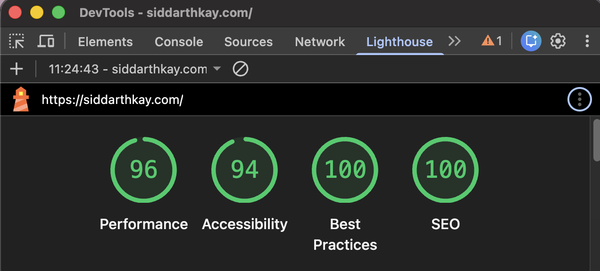

# siddarthkay.com

Personal site. Built with Vite, React, TypeScript, and Tailwind. Deployed on GitHub Pages.



## Live data

Health vitals (Whoop) and gaming activity (Steam) update automatically every 6 hours via GitHub Actions.

## Development

```bash
npm install
npm run dev
```

## Scripts

- `scripts/fetch-whoop.mjs` — pulls recovery, sleep, strain data from the Whoop API
- `scripts/fetch-steam.mjs` — pulls recently played games from the Steam API
- `scripts/whoop-auth.sh` — one-time OAuth flow to get a Whoop refresh token
